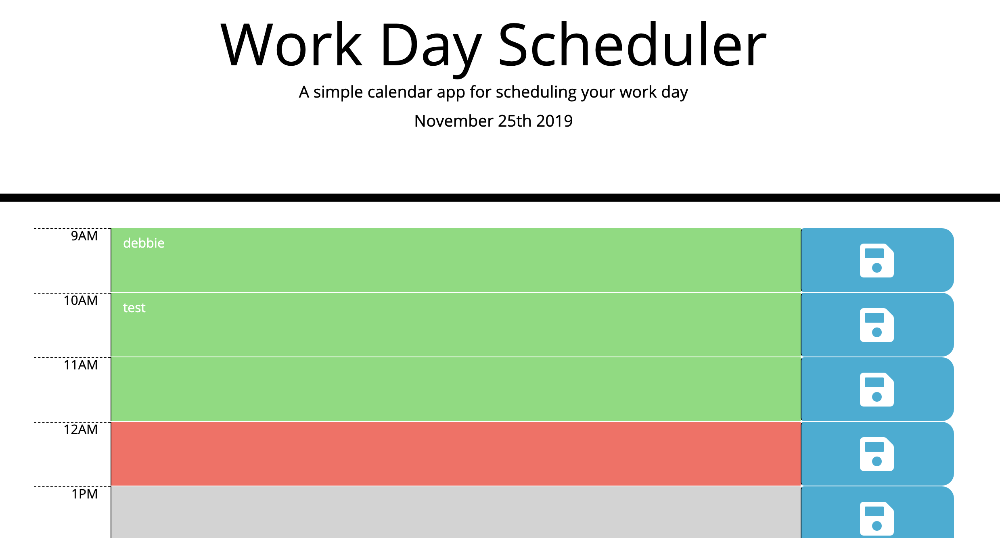

# Unit 05 Third-Party APIs Homework: Day Planner

Simple calendar application that allows the user to save events for each hour of the day. This app runs in the browser and feature dynamically updated HTML and CSS powered by jQuery.

Near the top of the calendar, the application displays the current day. Additionally, each hour is color coded to reflect whether the time slot is in the past, the present, or the future. This will change depending on the time of day.

